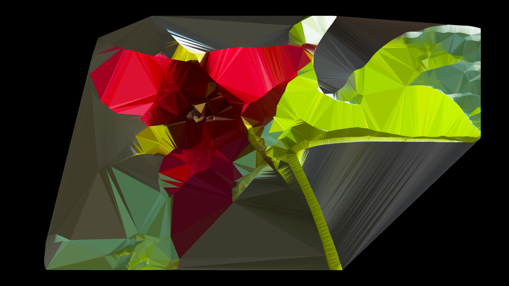
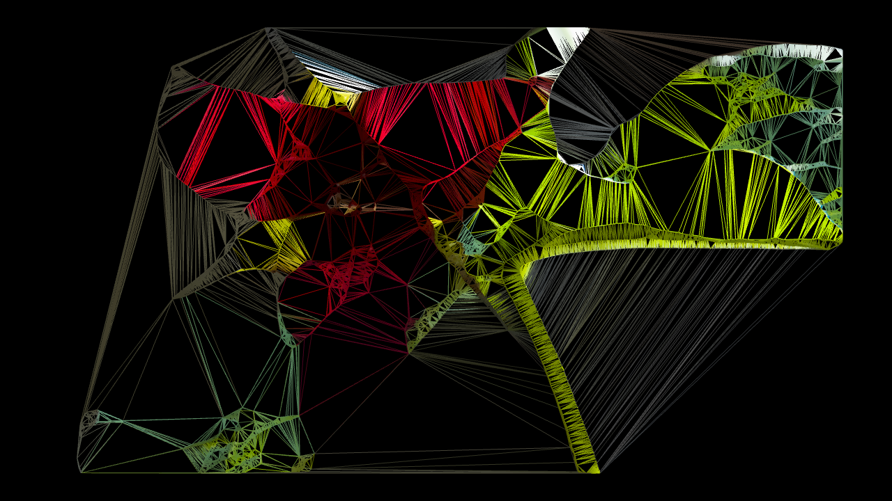
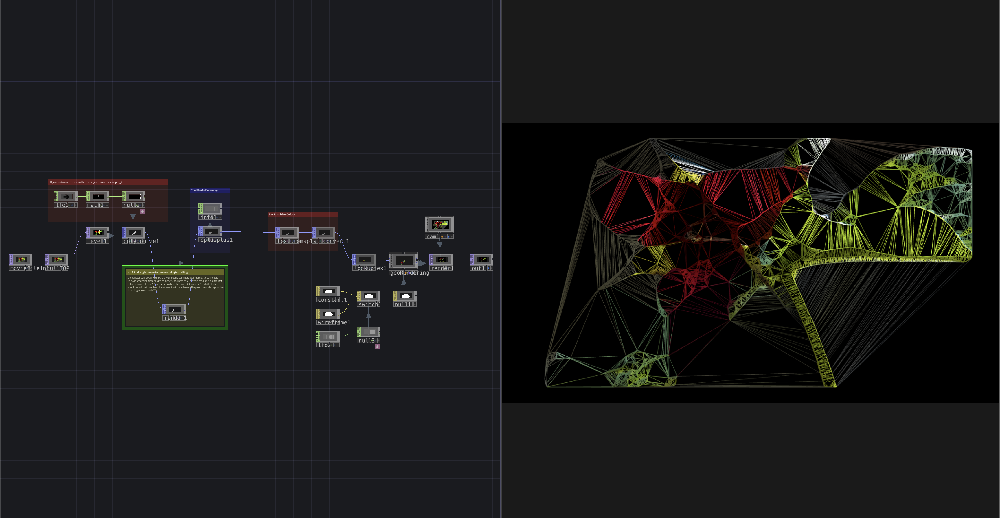

# Delaunay POP v1.0

A POP plugin for TouchDesigner that generates **2D Delaunay triangulation** from a point input.

## What It Does

- Reads points from the input POP's `P` attribute
- Projects points onto the `XY`, `YZ`, or `ZX` plane
- Generates Delaunay triangles reliably, even with degenerate inputs
- Supports both `Sync` and `Async` modes through the `Async` toggle
  - `Async` mode is recommended for animated or continuously changing inputs because it allows non-blocking computation
  - For static inputs, `Sync` mode is recommended to ensure immediate and deterministic results
- Passes point attributes through to the output like a standard POP operator

## Libraries Used

- TouchDesigner POP C++ API
- Delaunator C++ (header-only)

## Requirements
- Touchdesigner 2025+ (If you just use the plugin elsewhere)
- TouchDesigner 2025.32440+ (If you open the examples, due the Trace POP)

## Installation

- Copy the plugin into your project and load it through the `CPlusPlus POP` operator, as shown in the examples provided in `Delaunay Example/MAC` or `Delaunay Example/WINDOWS`
- Alternatively, install it directly in TouchDesigner like any other Custom OP so that it becomes available from the **Custom** panel in the **OP Create Dialog**

Custom OPs can be installed by placing the plugin in the correct location on disk. TouchDesigner will detect it automatically at startup.

- On Windows, a plugin is a `.dll` file, possibly accompanied by additional files
- On macOS, a plugin is a `.plugin` folder

### Plugin Locations

#### Windows

`Documents/Derivative/Plugins`

Typical path:

`C:/Users/<username>/Documents/Derivative/Plugins`

#### macOS

`/Users/<username>/Library/Application Support/Derivative/TouchDesigner099/Plugins`

## Distribution

- Plugin format: `.plugin` (macOS bundle), `.dll` (Windows)
- Operator name: `Delaunay`
- Version: `1.0`
- License: `MIT`
- Author: [Edwin Lucchesi](https://www.edwinlucchesi.com/)

## Share Your Results

If you use this plugin, feel free to tag me.
I'll be happy to see your results!

Instagram: [@Alaghast](https://www.instagram.com/alaghast/)

2025-26
